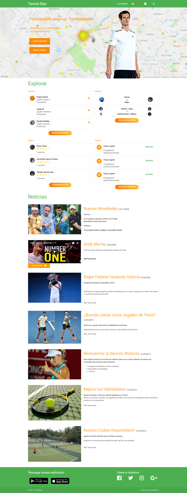
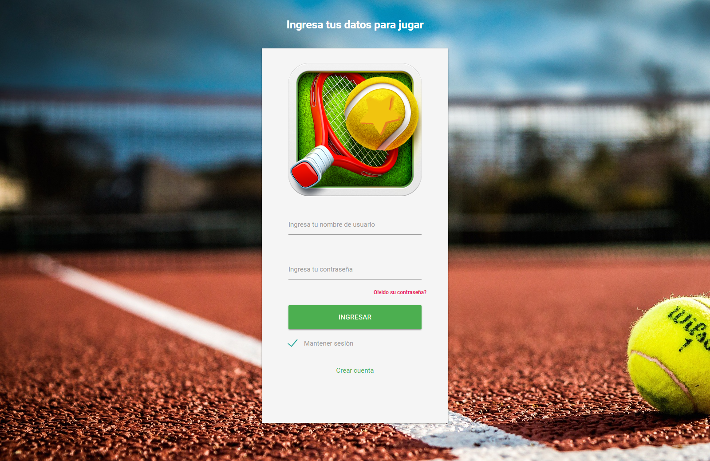
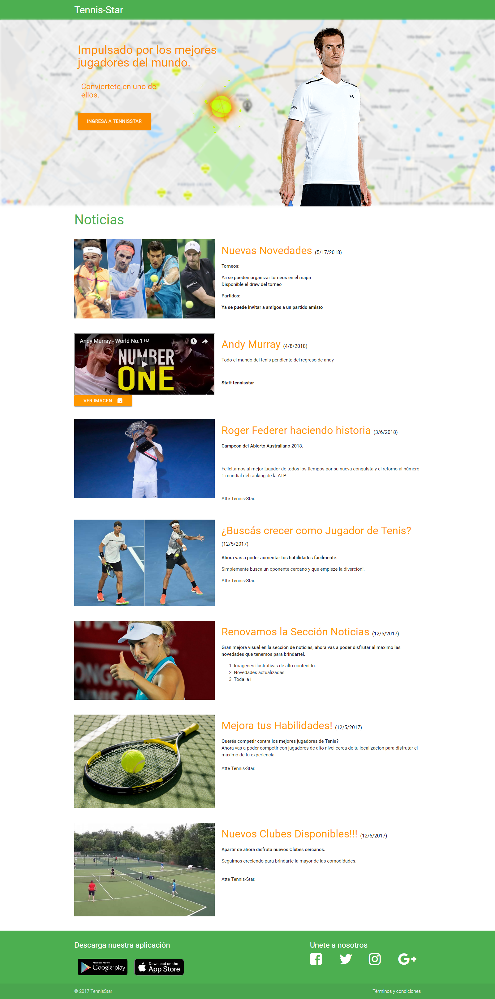
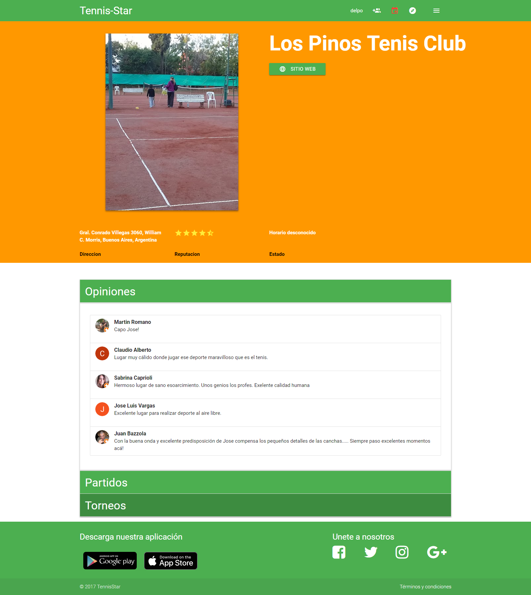
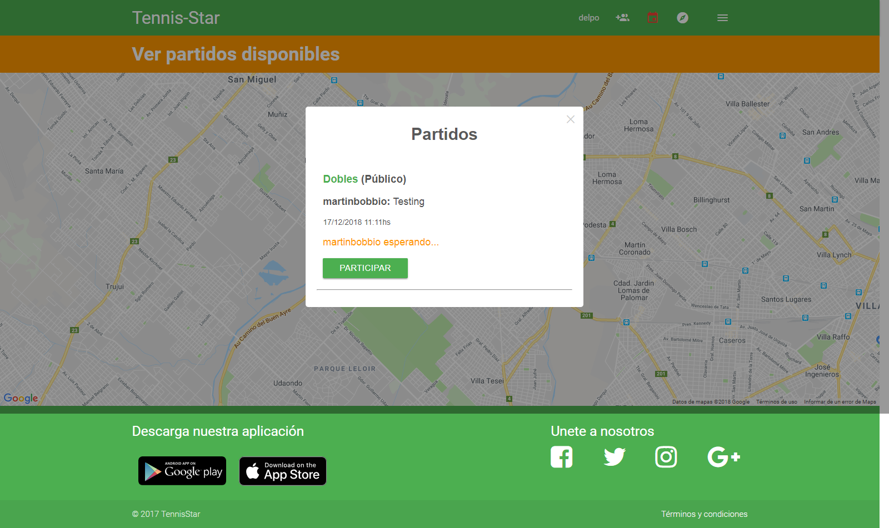
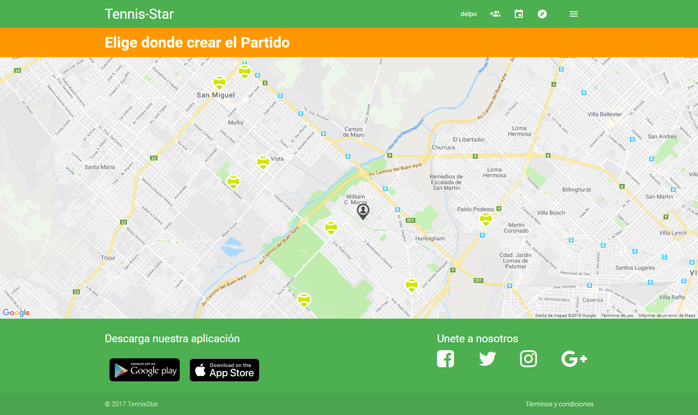
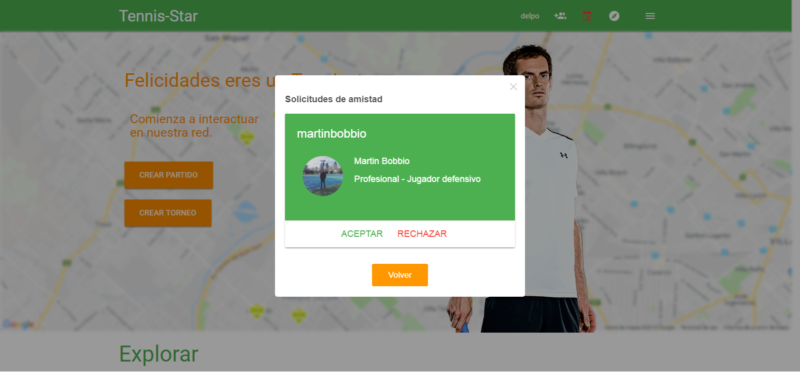
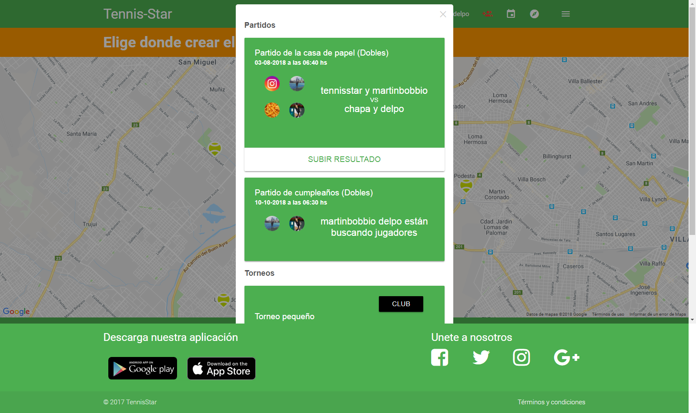

<h1 align="center">
   
  
   
  Tennis-Star
   
</h1>

<h4 align="center">Aplicación web de <a href="https://www.tennis-star.com" target="_blank">Tennis-Star</a>.</h4>

    

## Descripción

Tennis-Star es un sitio WEB que permite a sus Usuarios la posibilidad de ser parte de una gran comunidad en el mundo del Tenis, brindando la posibilidad de conocer nuevos Jugadores, buscar clubes cercanos a tu posicion actual, crear partidos y/o torneos.
Ademas Tennis-Star cuenta con un sistema de puntos, los cuales los Jugadores van acumulando a medida que participen mas con otros Jugadores, y siempre informando a sus Usuarios con las ultimas noticias del Sitio o de las novedades del mundo del Tenis Profecional.

Como usuario de Tennis-Star puedes contar con un control de tus habilidades y compararlas con otros jugadores brindadote mas informacion de tus Amigos y Contrincantes, permitiendo asi la comparacion de atributos de cada Jugador. Cada Jugador cuenta con su propio perfil en el cual pueden seleccionar su imagen de Perfil la cual es visible para toda la comunidad.

Las herramientas y lenguajes utilizados para el desarrollo del sitio WEB frontend son:
* Angular 2
* TypeScript
* Materialize
* PHP
* MySQL

## Capturas

HomePage:

 

Login:

 

Pagina Principal:

 

Partido:

 

Club:

 

Vista de Partidos:

 

Notificaciones:

 
